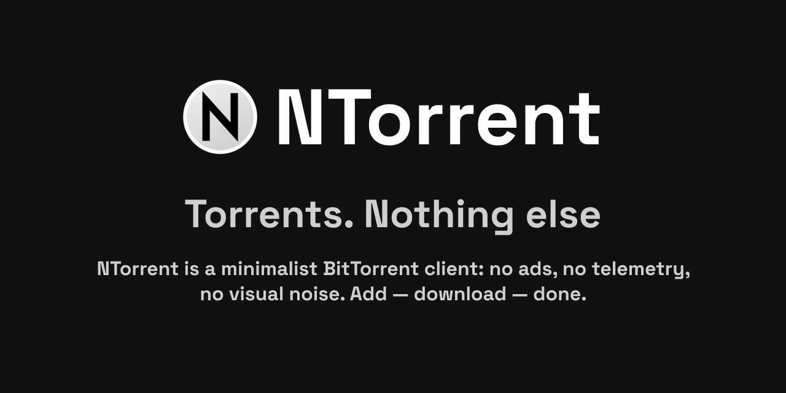
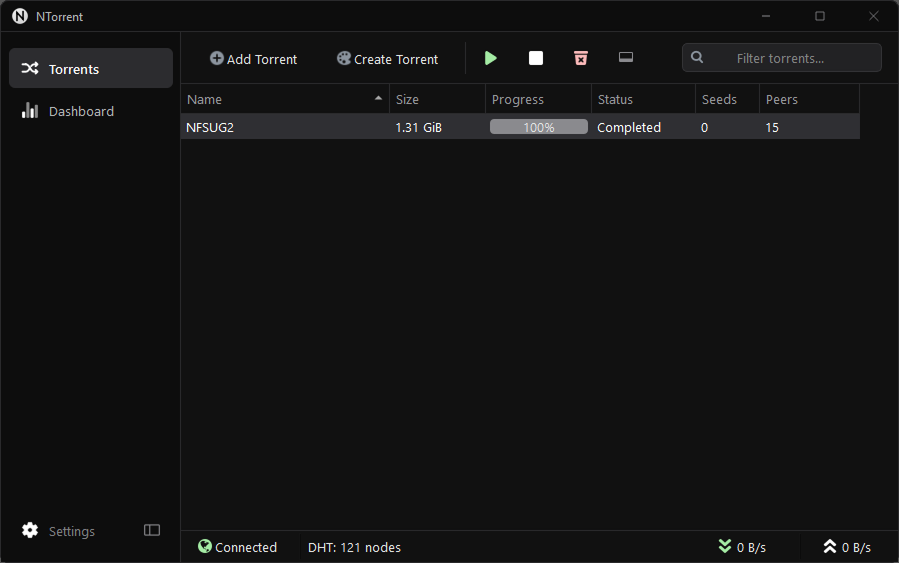
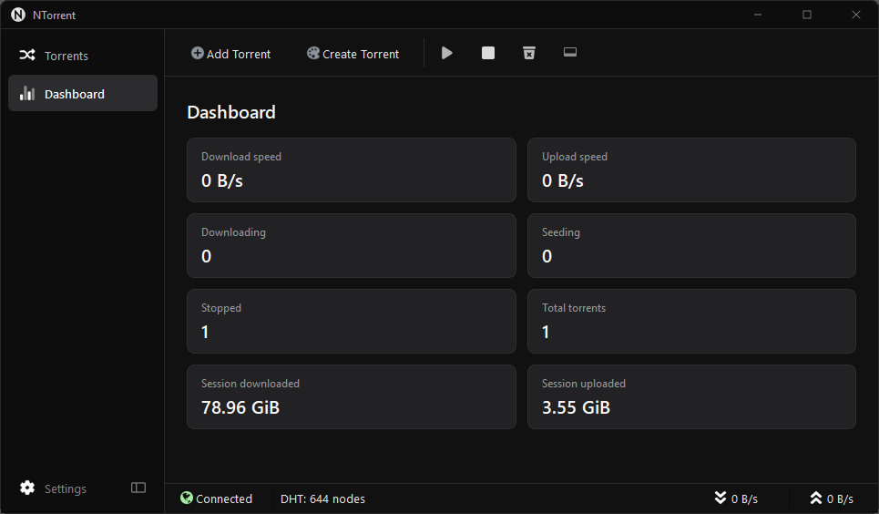

# NTorrent



**A streamlined, lightweight BitTorrent client for Windows.**

NTorrent is a simplified, carefully trimmed-down take on the qBittorrent experience — keeping the core torrent functionality while removing features, UI elements and components that aren't needed by everyone.

> **This repository contains official NTorrent binary releases.**

[**Download the latest release →**](../../releases/latest)

---

## ✨ What is NTorrent?

NTorrent is built on the same proven foundation as qBittorrent and libtorrent, but takes a different approach to the user experience.

NTorrent focuses on:
* 🪶 **Lightweight experience** — fewer unnecessary components and UI elements
* 🧹 **Less clutter** — many rarely-used features have been removed
* 🔒 **No advertising**
* 📡 **No added telemetry or analytics**
* 🪟 **Windows-focused experience** (MacOS/Linux coming soon)

---

## 🖼️ Screenshots

### Main window



### Torrent dashboard



> Screenshots show the current NTorrent interface. The UI may change between releases!

---

## 📥 Download

**This is the official NTorrent release repository.**

The safest way to obtain NTorrent is from:

* this GitHub repository
* the official NTorrent website: **https://ntorrent.aerlab.net/**

#### 🛡️ ! Safety !
Please do not rely on unofficial mirrors or modified builds.

If you found an NTorrent installer somewhere other than the official website or this repository, **it may not be an official NTorrent build**.

**Official sources:**

* 🌐 [ntorrent.aerlab.net](https://ntorrent.aerlab.net/)
* 🐙 [github.com/shield-master/NTorrent-releases](https://github.com/shield-master/NTorrent-releases)

NTorrent does not endorse or support third-party builds.

If another website distributes an `NTorrent.exe`, that does **not** mean the file was produced by this project.

---

## 🔐 Why is the source code private?

NTorrent is currently distributed as a closed-source application.

The source code is kept private to maintain a single, clearly identifiable official NTorrent distribution and to prevent unofficial modified builds from being distributed under the NTorrent name.

If you want to understand what is inside NTorrent, the vast majority of its functionality comes directly from established open-source projects:

* **[qBittorrent](https://github.com/qbittorrent/qBittorrent)** — the main application foundation
* **[libtorrent](https://github.com/arvidn/libtorrent)** — the BitTorrent engine

The remaining NTorrent-specific work is primarily focused on the user interface, removing unnecessary components, small improvements, and project-specific modifications.

NTorrent does not claim to have developed the underlying BitTorrent technology from scratch. Its purpose is to provide a **simpler, cleaner and more focused experience** built on top of proven software.

---

## 🔄 Updates

NTorrent can check for new versions and, **with the user's consent**, download the latest official installer.

NTorrent does **not** install updates automatically.

When a new version is available, NTorrent can download the official installer and open it for you. The update is then performed manually through the normal Windows installer, with the user in control of the installation process.

You can also always download and install a new version manually from the [official Releases](../../releases/latest) page.

---

## 🔎 Verifying downloads

For additional verification, release files can be checked against their published SHA-256 hashes.

Example on Windows:

```powershell
Get-FileHash .\NTorrent-Setup.exe -Algorithm SHA256
```

The resulting hash should match the value published for the corresponding release.

> Hash verification confirms that the downloaded file matches the published release file. It does not by itself prove that the software is secure.

---

## ⚠️ Third-party modifications

Please be careful with unofficial "NTorrent" builds.

A modified torrent client could potentially contain:

* telemetry
* unwanted software
* altered networking behavior
* bundled installers
* advertising
* malware

NTorrent does not maintain or endorse third-party builds.

If you download an NTorrent installer from another website, repository or mirror, it may have been modified and is not considered an official NTorrent release.

---

📜 Open-source & attribution

NTorrent is built on established open-source software, including:

qBittorrent — application foundation
libtorrent — BitTorrent engine

These projects remain subject to their respective licenses and copyrights.

NTorrent is a separate project with its own modifications, including UI changes, removed components, improvements and other project-specific work.

---

## ❤️ NTorrent

If you just wanted a clean torrent client without spending time configuring a hundred options you will never use, that's exactly what NTorrent is trying to be.

**Download:** [Latest release →](../../releases/latest)

**Website:** [ntorrent.aerlab.net/](https://ntorrent.aerlab.net/)

**Donate:** [Tribute](https://web.tribute.tg/d/FIQ)
